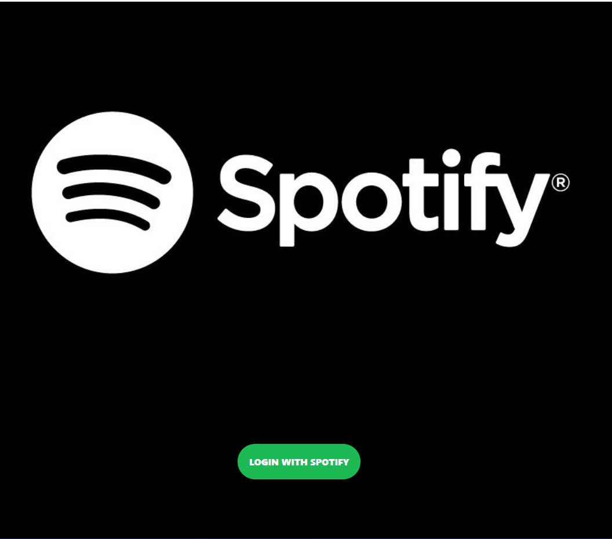
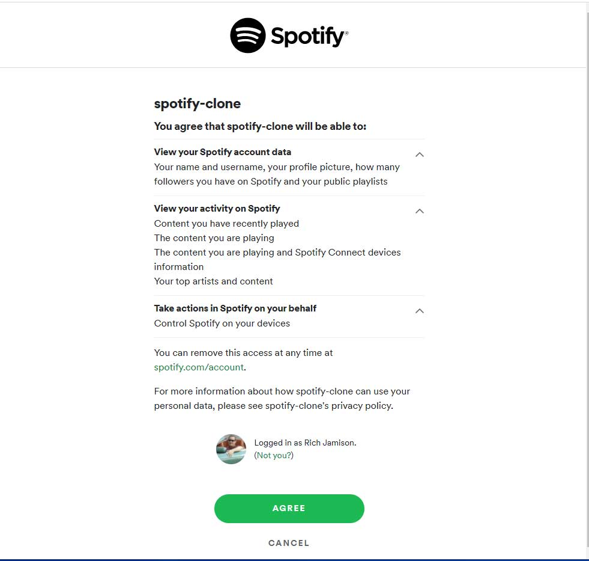
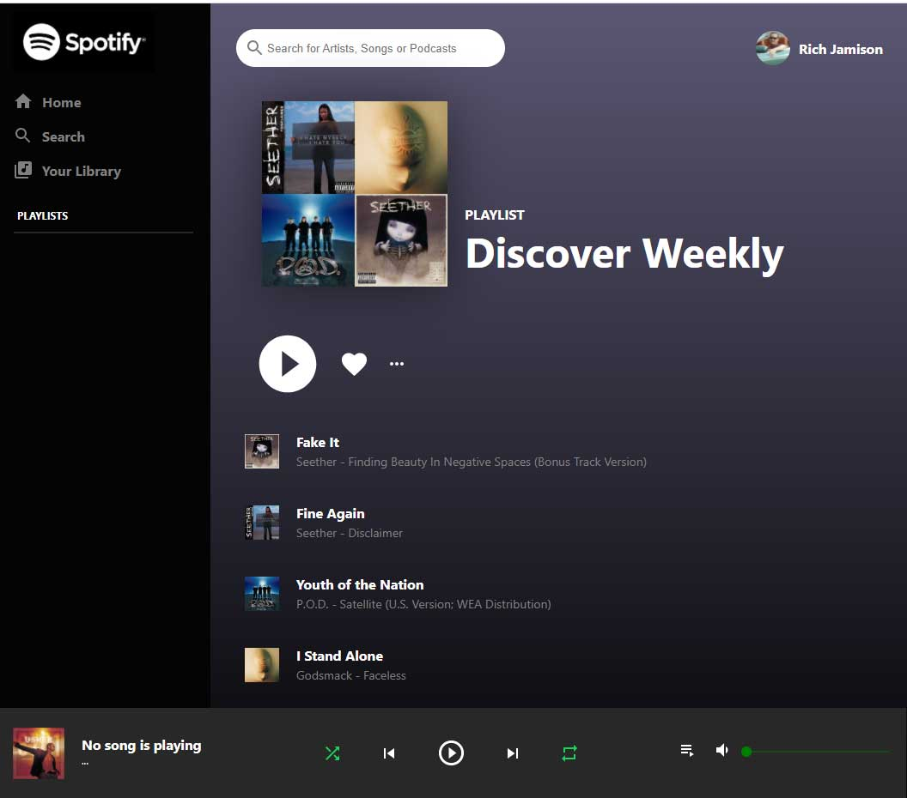

# Spotify Clone

This project was created with React and javascript. Spotify clone that has a main login page, a confirmation that you are the user, and then after you login wit your real spotify account, the main app loads.

## Main Spotify login page 👇
This is the main Spotify login page. When you click the green button you are directed to this page:

## Spotify user login screen 👇
This page confirms you are going to login witn your Spotify account. Click the green Agree button and you will be taken to your main Spotify player.

## Spotify player page 👇
This is the main spotiy player page that works like the real Spotify.

## Made with React

This project was alot of fun and has some nice rollover animations and smooth scroll features built-in. Used axios to pull in data from exteral movie database.

The final app can be viewed here  <a href="https://netflix-clone-69965.web.app/"> Netflix clone</a>  - use back arrow to get back to this github page.
